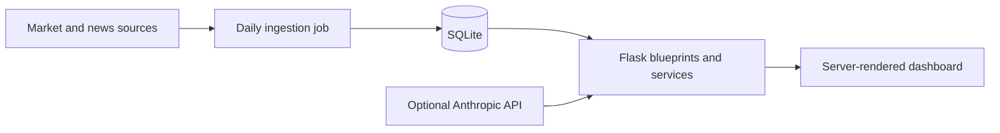

# Finance Insight

[](https://github.com/SXT2918/finance-insight/actions/workflows/ci.yml)

An educational Flask application for organizing market prices, indicators, news,
watchlists, research notes, portfolio observations, and AI-assisted briefs. It is a
research workflow demonstration—not investment advice or an automated trading system.

## Architecture



## Local setup

```bash
python -m venv .venv
source .venv/bin/activate  # Windows: .venv\Scripts\activate
pip install -e ".[dev]"
cp .env.example .env       # Windows: Copy-Item .env.example .env
python scripts/init_db.py  # optional starter watchlist
flask --app app run
```

The database schema is created automatically. AI features show a not-configured state
when `ANTHROPIC_API_KEY` is absent.

## Refresh, testing, and deployment

Run `python jobs/daily_job.py` to refresh data and `pytest -q` to test. Production
instructions and scheduler trade-offs are in [DEPLOY.md](DEPLOY.md). Scheduling remains
an explicit operator choice so failures can be monitored rather than hidden in a web
worker.

## Limitations

- Market data may be delayed, incomplete, or unavailable.
- Generated summaries can be incorrect and require source links and timestamps.
- SQLite and one web worker suit a portfolio demo, not a large multi-user service.
- Do not enter brokerage credentials or rely on the application for financial decisions.

See [SECURITY.md](SECURITY.md). Historical prototype and development-prompt artifacts are
kept under `docs/development-history/` so they are not confused with the supported app.
